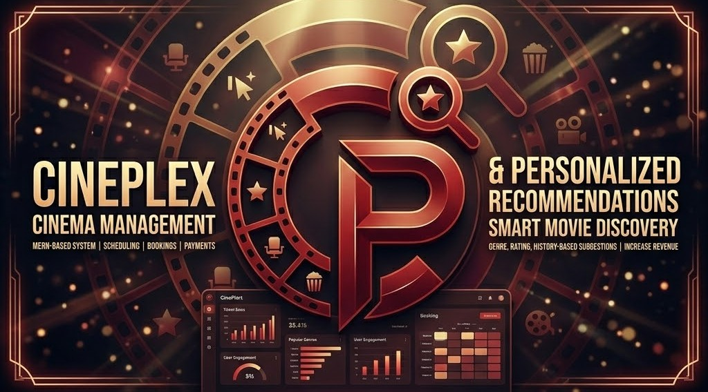

# 🎬 CinePlex

<div align="center">



### A Cinema Management & Movie Recommendation Platform

[](https://react.dev/)
[](https://nodejs.org/)
[](https://mongodb.com/)
[](https://expressjs.com/)
[](https://socket.io/)
[](https://www.themoviedb.org/)

</div>

---

# 📖 Overview

**CinePlex** is a modern cinema management and movie recommendation web application built with the **MERN Stack**.

The platform combines:

- 🎥 Cinema Management
- 🍿 Real-Time Ticket Booking
- 🤖 Personalized Movie Recommendations
- 📊 Admin Analytics Dashboard
- 💺 Live Seat Selection
- 🔐 Secure Authentication
- 📱 Fully Responsive UI

CinePlex delivers a cinematic user experience while helping cinemas manage movies, schedules, bookings, and customers efficiently.

---

# ✨ Features

## 👤 User Features

- User Authentication (JWT)
- Login & Registration
- Personalized Movie Recommendations
- Browse Now Showing & Upcoming Movies
- Movie Search & Filters
- Movie Details & Trailers
- Real-Time Seat Selection
- Live Seat Locking
- Ticket Booking
- QR Code Ticket Generation
- Booking History
- Favorites & Watchlist
- Reviews & Ratings
- Responsive Netflix-Inspired UI

---

## 🛠️ Admin Features

- Admin Dashboard
- Movie Management
- Cinema Room Management
- Showtime Scheduling
- Booking Monitoring
- Revenue Analytics
- Occupancy Reports
- User Management
- Sales Statistics
- Dynamic Pricing Support

---

# 🧠 Recommendation System

CinePlex uses a hybrid recommendation system powered by:

- TMDB API
- User watch history
- Favorite genres
- Search behavior
- Trending movies
- Similar movie recommendations

### Recommendation Sections

- 🔥 Trending Now
- 🎯 Top Picks For You
- 🍿 Because You Watched
- ⭐ Top Rated
- 🎬 Upcoming Movies

---

# 🖥️ Tech Stack

## Frontend

````bash
- React.js
- Vite
- Tailwind CSS
- React Router
- Axios
- Framer Motion
- Zustand or Redux Toolkit
- TanStack Query
- Recharts
- Socket.IO Client

## Backend

````bash
- Node.js
- Express.js
- MongoDB
- Mongoose
- JWT
- bcrypt
- Socket.IO
- Multer
- Cloudinary

## External Services

````bash
- TMDB API
- MongoDB Atlas
- Cloudinary
- Stripe-ready payment integration
- Vercel
- Render or Railway

---